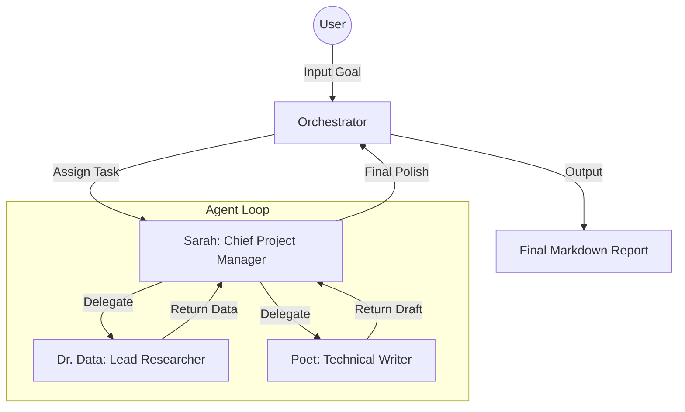

# 🟡 AgentVerse: Universal Agent Universe

**AgentVerse** is a professional-grade multi-agent collaboration system designed for autonomous task delegation, deep research, and high-quality technical writing. Featuring a premium "Pac-Man Edition" glassmorphism interface, it bridges the gap between local LLMs (Ollama) and cloud-based giants (Groq, Gemini).

 *(Note: Replace with actual screenshot after deployment)*

Deployment Link: https://multi-agent-universegit-u88n7nm3uw2cizhfkqweqo.streamlit.app/

## 🚀 Features

- **Autonomous Orchestration**: A central `Orchestrator` manages a universe of specialized agents (Sarah the Manager, Dr. Data the Researcher, and Poet the Writer).
- **Anti-Ping-Pong Protocol**: Sophisticated logic to prevent circular delegation loops and ensure mission closure.
- **Provider Agnostic**: Seamlessly switch between **Groq** (Llama 3), **Google Gemini**, and **Ollama** (Local).
- **Retro-Modern UI**: A stunning Streamlit interface with glassmorphism effects, live agent activity cards, and a Pac-Man theme.
- **Persistent Mission History**: Automatically saves and loads past missions, complete with generated reports and logs.
- **Professional Reporting**: Generates polished Markdown reports saved directly to the `outputs/` directory.
- **Interactive Refinement**: Post-mission follow-up system allowing users to refine results with additional instructions.

## 🛠️ Tech Stack

- **Core**: Python 3.10+
- **Agent Logic**: Pydantic for structured data validation.
- **Frontend**: Streamlit + Custom CSS (Glassmorphism).
- **LLM Connectivity**: 
  - `groq` (High-speed Llama)
  - `google-genai` (Gemini 2.0 Flash)
  - `ollama` (Local execution)
- **Utilities**: `python-dotenv`, `rich` (CLI logging).

## 📂 Project Structure

```bash
├── core/
│   ├── agent.py        # Agent and Orchestrator logic
│   ├── llm_provider.py # LLM Factory and Provider implementations
│   └── models.py       # Pydantic definitions for tasks/output
├── utils/
│   ├── history.py      # Mission persistence logic
│   └── logger.py       # Console logging utilities
├── outputs/            # Generated Markdown reports
├── app.py              # Streamlit Web Application
├── main.py             # CLI Entry Point
├── .env                # Environment variables (API Keys)
└── requirements.txt    # Project dependencies
```

## ⚙️ Setup & Installation

1. **Clone the Repository**:
   ```bash
   git clone https://github.com/your-username/multi-agent-universe.git
   cd multi-agent-universe
   ```

2. **Install Dependencies**:
   ```bash
   pip install -r requirements.txt
   ```

3. **Configure Environment**:
   Create a `.env` file in the root directory:
   ```env
   # Default LLM Provider (ollama, groq, gemini)
   DEFAULT_PROVIDER=groq

   # API Keys
   GROQ_API_KEY=your_groq_api_key
   GEMINI_API_KEY=your_gemini_api_key

   # Model Selections
   GROQ_MODEL=llama-3.1-8b-instant
   GEMINI_MODEL=gemini-2.0-flash
   OLLAMA_MODEL=llama3
   OLLAMA_HOST=http://localhost:11434
   ```

## 🎮 How to Run

### Web Interface (Recommended)
Launch the beautiful Pac-Man themed UI:
```bash
streamlit run app.py
```

### CLI Mode
Run a quick task from the console:
```bash
python main.py
```

## 🧠 Architecture

The system uses a **Recursive Delegation Pattern**:



## 🛡️ Safety & Reliability

- **Emergency Stop**: A manual kill-switch in the UI to halt agent collaboration instantly.
- **Shared Memory**: Agents have "recent mission context" to avoid repeating mistakes or asking duplicate questions.
- **Iteration Limits**: Default safety cap of 12 turns per mission to prevent runaway costs or infinite loops.

## 📄 License
This project is licensed under the MIT License - see the LICENSE file for details.
